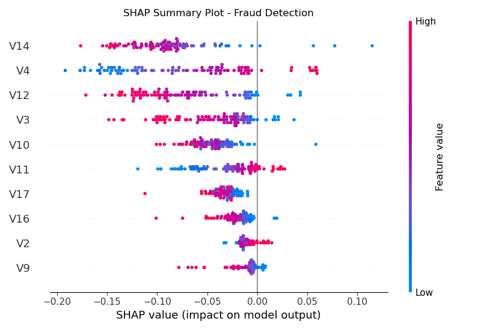
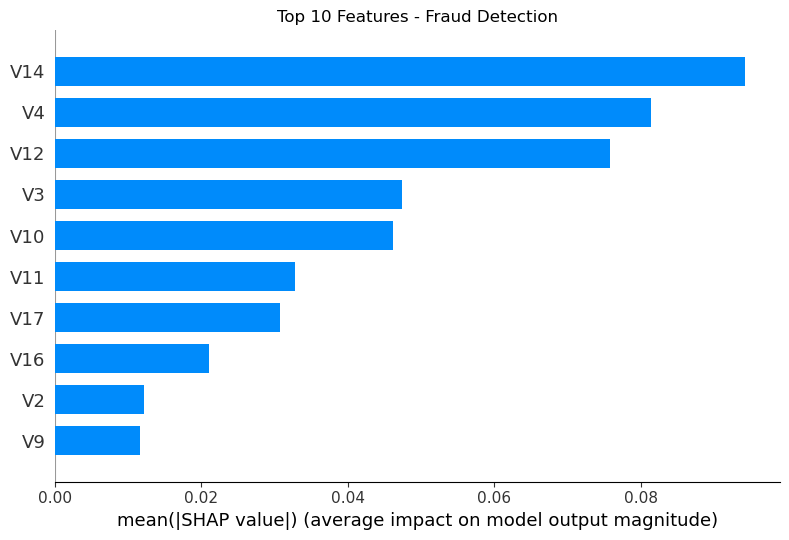
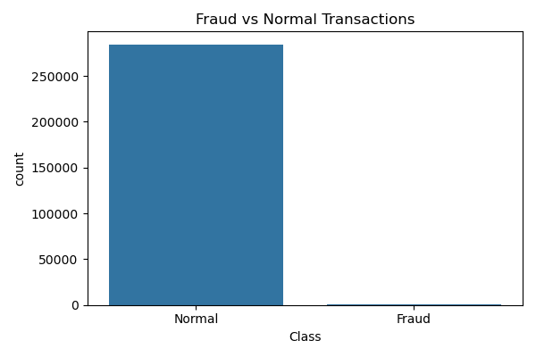

<div align="center">

# 💳 Credit Card Fraud Detection System

### _Real-Time Fraud Intelligence Powered by Machine Learning & Explainable AI_

<br>


<br>

> 🛡️ An enterprise-grade fraud detection pipeline that analyzes **284,807 transactions**,
> handles extreme class imbalance with **SMOTE**, and achieves a **96.54% fraud detection rate**
> — with full model transparency via **SHAP explainability**.

<br>

[🚀 Getting Started](#-getting-started) •
[📊 Results](#-key-results) •
[🧠 How It Works](#-how-it-works) •
[🖼️ Screenshots](#️-screenshots) •
[🤝 Contributing](#-contributing)

</div>

---

## 📑 Table of Contents

- [Problem Statement](#-problem-statement)
- [Key Results](#-key-results)
- [How It Works](#-how-it-works)
- [Complete Model Performance](#-complete-model-performance)
- [SHAP Explainability Insights](#-shap-explainability-insights)
- [Screenshots](#️-screenshots)
- [Tech Stack](#️-tech-stack)
- [Project Structure](#-project-structure)
- [Getting Started](#-getting-started)
- [Dataset](#-dataset)
- [Contributing](#-contributing)
- [License](#-license)
- [About the Author](#-about-the-author)

---

## 🎯 Problem Statement

Credit card fraud costs the global economy **$32 billion annually**. Traditional rule-based detection systems are rigid, slow to adapt, and fail to capture complex, evolving fraud patterns.

This project tackles the problem with a **machine learning pipeline** that:

- ✅ Trains on **284,807 real-world transactions** from a highly imbalanced dataset (only **0.17% fraud**)
- ✅ Applies **SMOTE** (Synthetic Minority Oversampling Technique) to balance the classes
- ✅ Compares **Logistic Regression**, **Random Forest**, and **XGBoost** to select the best model
- ✅ Uses **SHAP** (SHapley Additive exPlanations) for full model transparency and interpretability
- ✅ Deploys an interactive **Streamlit dashboard** for real-time single & batch transaction analysis

---

## 📊 Key Results

<div align="center">

| Metric | Score |
|:---|:---:|
| 🎯 **Fraud Detection Rate** | **96.54%** |
| 🔁 **Recall (Sensitivity)** | **83%** |
| 🎯 **Precision** | **83%** |
| ⚖️ **F1-Score** | **83%** |
| 📦 **Dataset Size** | 284,807 transactions |
| ⚠️ **Fraud Rate** | 0.17% (extreme imbalance) |

</div>

> **96.54%** of all fraudulent transactions in the dataset were successfully detected — catching **475 out of 492** fraud cases.

---

## 🧠 How It Works

```
┌─────────────────────────────────────────────────────────────────────┐
│                     FRAUD DETECTION PIPELINE                        │
├─────────────────────────────────────────────────────────────────────┤
│                                                                     │
│   📥 Raw Data        ──►  🔍 EDA & Feature       ──►  ⚖️ SMOTE     │
│   (284,807 txns)          Analysis                    Resampling    │
│                                                                     │
│   🤖 Model Training  ──►  🏆 Best Model          ──►  🧪 Testing   │
│   (LR / RF / XGB)         Selection (RF)              on Full Data  │
│                                                                     │
│   🔮 SHAP            ──►  🖥️ Streamlit           ──►  📊 Real-Time │
│   Explainability          Dashboard                   Predictions   │
│                                                                     │
└─────────────────────────────────────────────────────────────────────┘
```

**Step-by-step breakdown:**

1. **Exploratory Data Analysis** (`01_EDA.ipynb`) — Understand distributions, correlations, and the extreme class imbalance
2. **Model Training & Evaluation** (`02_model.ipynb`) — Train three classifiers, apply SMOTE, evaluate with precision/recall/F1
3. **SHAP Explainability** (`03_shap.ipynb`) — Generate SHAP summary plots and feature importance to understand _why_ the model flags fraud
4. **Streamlit Dashboard** (`app.py`) — Interactive web app for single-transaction analysis and bulk CSV batch processing

---

## 📈 Complete Model Performance

### 📋 Dataset Overview

| Property | Value |
|:---|:---:|
| Total Transactions | 284,807 |
| Normal Transactions | 284,315 (99.83%) |
| Fraud Transactions | 492 (0.17%) |
| Training Set | 227,845 (80%) |
| Test Set | 56,962 (20%) |

### ⚖️ SMOTE — Class Imbalance Handling

Without resampling, the model would be biased toward predicting everything as "normal." **SMOTE** synthetically oversamples the minority (fraud) class to create a balanced training set:

| Class | Before SMOTE | After SMOTE |
|:---|:---:|:---:|
| Normal | 227,451 | 227,451 |
| Fraud | 394 | 227,451 ✅ |
| **Total** | **227,845** | **454,902** |

### 🏆 Model Comparison

| Model | Precision | Recall | F1-Score | Selected? |
|:---|:---:|:---:|:---:|:---:|
| Logistic Regression | 12% | 90% | 20% | ❌ |
| **Random Forest** | **83%** | **83%** | **83%** | **✅ Winner** |
| XGBoost | 79% | 85% | 82% | ❌ |

> **Why Random Forest?** It achieves the best balance between precision and recall — catching the most fraud with the fewest false alarms.

### 🧪 Final Full-Dataset Test

| Metric | Value |
|:---|:---:|
| Total Fraud in Dataset | 492 |
| Fraud Successfully Detected | 475 |
| **Detection Rate** | **96.54%** 🔥 |

---

## 🔬 SHAP Explainability Insights

SHAP values provide **transparent, per-prediction explanations** — critical for regulatory compliance and trust in financial ML systems.

| Rank | Feature | Insight |
|:---:|:---|:---|
| 🥇 | **V14** | Low V14 values are the strongest fraud signal 🚨 |
| 🥈 | **V4** | Low V4 values consistently indicate fraudulent behavior |
| 🥉 | **V12** | Low V12 is a strong secondary fraud indicator |
| 4️⃣ | **V11** | High V11 values correlate with fraudulent transactions |

> 💡 **Note:** Features V1–V28 are PCA-transformed components from the original dataset (anonymized for confidentiality). SHAP reveals which components drive the model's decisions despite this anonymization.

---

## 🖼️ Screenshots

### SHAP Summary Plot
> _Each dot represents a feature's SHAP value for a single prediction. Color indicates feature value (red = high, blue = low)._



### SHAP Feature Importance (Bar Plot)
> _Global feature importance — the mean absolute SHAP value across all predictions._



### Class Distribution — Before SMOTE
> _The extreme imbalance: 99.83% normal vs. 0.17% fraud._



---

## ⚙️ Tech Stack

| Category | Tools |
|:---|:---|
| **Language** | Python 3.8+ |
| **ML Models** | Random Forest, XGBoost, Logistic Regression |
| **Imbalance Handling** | SMOTE (imbalanced-learn) |
| **Explainability** | SHAP |
| **Visualization** | Matplotlib, Seaborn |
| **Web Framework** | Streamlit |
| **Serialization** | Joblib |
| **Data Processing** | Pandas, NumPy |

---

## 🗂️ Project Structure

```
credit-fraud-detector/
│
├── 📓 01_EDA.ipynb              # Exploratory Data Analysis
├── 📓 02_model.ipynb            # Model Training & Evaluation (LR, RF, XGB)
├── 📓 03_shap.ipynb             # SHAP Explainability Analysis
│
├── 🖥️ app.py                    # Streamlit Dashboard (single + batch analysis)
├── 🤖 fraud_model.pkl           # Trained Random Forest model (serialized)
│
├── 📊 creditcard.csv            # Full dataset (download from Kaggle)
├── 📊 sample_transactions.csv   # Sample data for quick testing
├── 📊 test_transactions.csv     # Test dataset for validation
├── 📊 fraud_only.csv            # Extracted fraud transactions
├── 📊 fraud_tsx.csv             # Fraud transaction subset
│
├── 🖼️ shap_summary.png          # SHAP summary plot
├── 🖼️ shap_bar.png              # SHAP feature importance bar chart
├── 🖼️ class_imbalance.png       # Class distribution visualization
│
├── 📋 requirements.txt          # Python dependencies
├── 📄 LICENSE                   # MIT License
└── 📖 README.md                 # You are here!
```

---

## 🚀 Getting Started

### Prerequisites

- Python 3.8 or higher
- pip (Python package manager)
- Git

### Installation

```bash
# 1. Clone the repository
git clone https://github.com/Vidhya-Majee/credit-fraud-detector.git
cd credit-fraud-detector

# 2. Create a virtual environment (recommended)
python -m venv venv
source venv/bin/activate        # Linux/macOS
venv\Scripts\activate           # Windows

# 3. Install dependencies
pip install -r requirements.txt

# 4. Download the dataset from Kaggle
#    → https://www.kaggle.com/datasets/mlg-ulb/creditcardfraud
#    Place 'creditcard.csv' in the project root directory
```

### Running the Notebooks

Execute the notebooks in order to reproduce the full pipeline:

```bash
# Launch Jupyter
jupyter notebook

# Run in sequence:
# 📓 01_EDA.ipynb         → Explore the data
# 📓 02_model.ipynb       → Train & evaluate models
# 📓 03_shap.ipynb        → Generate SHAP explanations
```

### Launching the Dashboard

```bash
streamlit run app.py
```

The app will open at `http://localhost:8501` with:
- **🔍 Single Transaction Analysis** — Test individual transactions with pre-loaded fraud/normal samples or custom input
- **📂 Batch Analysis** — Upload a CSV of transactions for bulk fraud scoring with downloadable reports

---

## 📂 Dataset

| Property | Details |
|:---|:---|
| **Source** | [Kaggle — Credit Card Fraud Detection](https://www.kaggle.com/datasets/mlg-ulb/creditcardfraud) |
| **Transactions** | 284,807 |
| **Features** | 30 (Time, V1–V28, Amount) |
| **Target** | Class (0 = Normal, 1 = Fraud) |
| **Size** | ~150 MB |

> ⚠️ **Note:** The dataset is not included in this repository due to its size. Please download it from Kaggle and place `creditcard.csv` in the project root.

---

## 🤝 Contributing

Contributions are welcome! Here's how you can help:

1. **Fork** the repository
2. **Create** a feature branch (`git checkout -b feature/amazing-feature`)
3. **Commit** your changes (`git commit -m 'Add amazing feature'`)
4. **Push** to the branch (`git push origin feature/amazing-feature`)
5. **Open** a Pull Request

### Ideas for Contribution

- 🧪 Add more ML models (LightGBM, Neural Networks)
- 📊 Add more interactive visualizations to the Streamlit dashboard
- 🔄 Implement real-time streaming fraud detection
- 📱 Add email/SMS alert notifications for high-risk transactions
- 🐳 Dockerize the application for easier deployment

---

## 📄 License

This project is licensed under the **MIT License** — see the [LICENSE](LICENSE) file for details.

---

<div align="center">

## 👩‍💻 About the Author

**Vidhya Majee** — BCA Student | Data Science & Full Stack Developer

[](https://linkedin.com/in/vidhya-majee-7807b9321)
[](https://github.com/Vidhya-Majee)

---

<br>

⭐ **If you found this project helpful, please consider giving it a star!** ⭐

_It helps others discover the project and motivates further development._

<br>

**Made with ❤️ and Python**

</div>